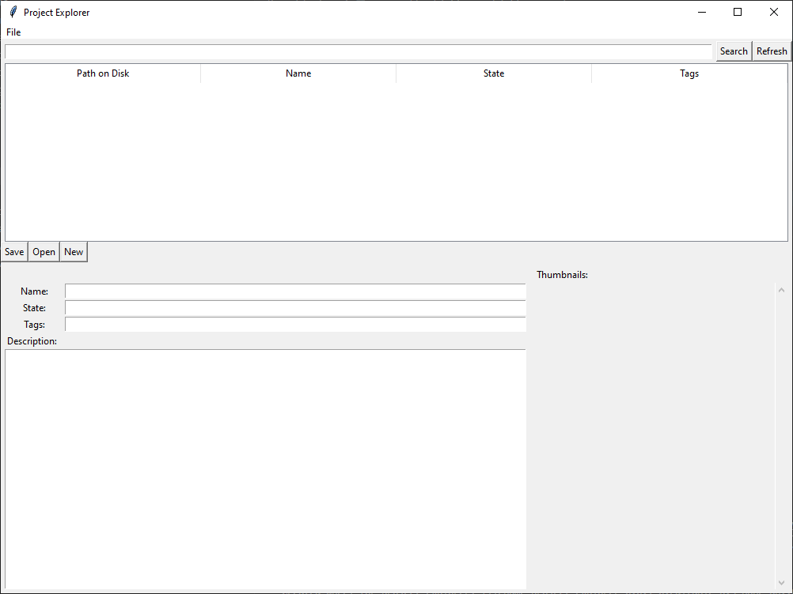

# Project-Explorer
General purpose, tag based, project organization tool

## Design

### Project

A project, from the standpoint of Project Explorer, is a directory containing a `project-info.json` and optionally a `description.md` and `thumbnails/`.
Other than this you are free to organize the actual contents of a project however you like.

### Name, State and Tags

You can associate a display name, general state (draft, published, ...) and some tags with a project, in order to find it again later.

### Projects Folder

(`File > Open Folder`)

Project Explorer gives a general overview all projects inside a parent folder.

## Features

### *Sleek UI*

### *Advanced* Querying

Within the search, you query as follows

* Directly, `state:draft` (state==draft) or `tags:art` (has tag art)
  which can be prefixed with `-` to negate the query (`tags:-art`)
  * Both `id:value` (exact match) and `id~value` (fuzzy match) can be used
* An OR of direct queries `state:-draft OR tags:art`
* An AND of OR and Direct queries `state:-draft AND (tags:art or tags:-complex)`

